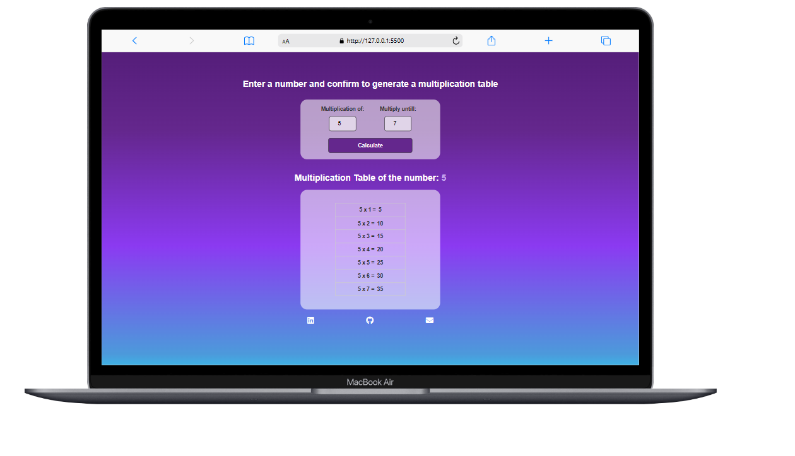

<h1 align="center">Multiplication Table Generator</h1>

  <a href="#project">Project</a>&nbsp;&nbsp;&nbsp;|&nbsp;&nbsp;&nbsp;
  <a href="#technologies">Technologies</a>&nbsp;&nbsp;&nbsp;|&nbsp;&nbsp;&nbsp;
  <a href="#preview">Preview</a>

  

## 💻 Project
This project is a simple web application that generates multiplication tables based on user input. It allows users to specify a number and a multiplicator, and then generates a multiplication table for that number up to the specified multiplicator.

## ✨ Technologies used:
- HTML
- CSS
- JavaScript
  
## 🏴󠁥󠁧󠁪󠁳󠁿 JavaScript Concepts Utilized
- DOM manipulation: Selecting and manipulating HTML elements using document.querySelector and innerHTML
- Event handling: Responding to user interactions using addEventListener to handle form submissions
- Template strings: Generating HTML content dynamically using template literals (``) to create and append table rows
- Variables and data validation: Declaring variables (const, let) to store user input and validate data before generating the table

## ⚙️ Features
- Dynamic generation of multiplication tables based on user input
- Simple and intuitive user interface

## 🔗 Preview
<a href="https://isabelaolsemann.github.io/MultiplicationTable" target="_blank">View multiplication table generator</a>
